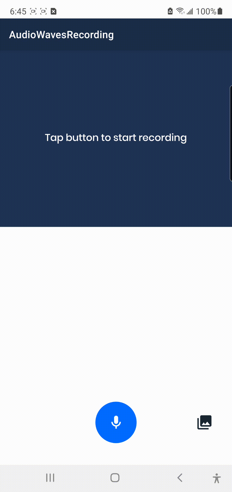
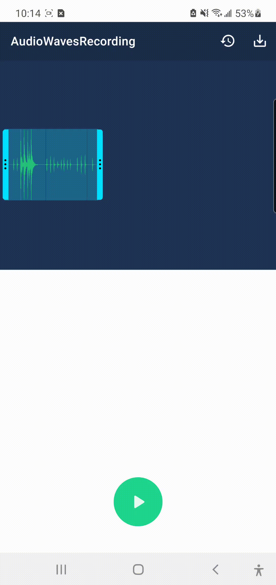

<a href="https://www.simform.com/"></a>
# SSAudioRecorderWithWaveForm
## Audio recording with wave form
[][git-repo-url] [](https://kotlinlang.org)  [](https://www.android.com/) [](https://android-arsenal.com/api?level=23)

SSAudioRecorderWithWaveForm is recording audio with wave form data, you can record audio using the app and also you can also pickup already recorded audio from gallery. The best thing is our application is after recording we can trim that audio from start point to end point using slider.

## Features

- Recording audio 🎤
- Playing back recordings ▶️
- Make recordings in M4A and WAV 🔈
- Displaying waveform of the recording 〰️•*¨*•.¸¸♬
- Import audio files 📁
- Trim recorded/imported audio 📇
- Customise trim marker 🖊️
- Customise waveform color 〰️🎨

#### Two recording formats are available:
 - M4A 🌊
 - Waveform Audio File Format (WAV) 〰️

# 🎬 Preview

| Recording Audio | color recording audio waves |
|--|--|
|  |  |

| Display recorded audio waves | Trim Recorded video |
|--|--|
|  |  |


## How to Use
1. Add display wave control view in you screen while recording video.
```xml
<com.wave.audiorecording.audioplayer.WaveformView
    android:id="@+id/record"
    android:layout_width="wrap_content"
    android:layout_height="@dimen/_200sdp"
    android:layout_marginTop="@dimen/_10sdp"
    android:layout_marginBottom="@dimen/_10sdp"
    android:background="@color/secoundryColor"
    app:layout_constraintEnd_toEndOf="parent"
    app:layout_constraintStart_toStartOf="parent"
    app:layout_constraintTop_toBottomOf="@+id/appLayout" />
```
2. Add wave recording or already pickup audio with using WaveformViewTrim control in design. 
```xml
<com.wave.audiorecording.audioplayer.trim.WaveformViewTrim
    android:id="@+id/audioWaveform"
    android:layout_width="match_parent"
    android:layout_height="@dimen/_85sdp"
    android:layout_centerInParent="true"
    android:layout_marginRight="@dimen/_10sdp" />
```
3. We can add MarkerView for Trim slider using MarkerView in your design.
```xml
<com.wave.audiorecording.audioplayer.trim.MarkerView
    android:id="@+id/markerStart"
    android:layout_width="wrap_content"
    android:layout_height="wrap_content"
    android:layout_centerVertical="true"
    android:contentDescription="@string/txt_start_marker"
    android:nextFocusDown="@+id/markerEnd"
    android:paddingStart="@dimen/_3sdp"
    android:paddingEnd="@dimen/_3sdp"
    app:srcCompat="@drawable/ic_left_trim" />       // starting trim slider
            
<com.wave.audiorecording.audioplayer.trim.MarkerView
    android:id="@+id/markerEnd"
    android:layout_width="wrap_content"
    android:layout_height="wrap_content"
    android:layout_centerVertical="true"
    android:contentDescription="@string/txt_end_marker"
    android:nextFocusUp="@+id/markerStart"
    android:nextFocusDown="@+id/info"
    android:paddingStart="@dimen/_3sdp"
    android:paddingEnd="@dimen/_3sdp"
    app:srcCompat="@drawable/ic_right_trim" />      // ending trim slider
```
4. we have to add this two permission in AndroidManifest.xml
```xml
<uses-permission android:name="android.permission.WRITE_EXTERNAL_STORAGE" />
<uses-permission android:name="android.permission.RECORD_AUDIO" />
```
5. We change change color of wave form while recording, display recorded waves form and current position of slider.
```xml
<color name="recording_waves_color">#FFFFFF</color>
<color name="recorded_waves_color">#FFFFFF</color>
<color name="recorded_current_index_line_color">#ffd600</color>
```

### Credits:
- This sample inspired by __[Audio Recorder]__

### UI Referance:
- This sample UI referance __[UI referance]__

## Find this sample useful? ❤️
Support it by joining __[stargazers]__ for this repository.⭐

## 🤝 How to Contribute

Whether you're helping us fix bugs, improve the docs, or a feature request, we'd love to have you! 💪
Check out our __[Contributing Guide]__ for ideas on contributing.

## Bugs and Feedback

For bugs, feature requests, and discussion please use __[GitHub Issues]__.

## License

```
Copyright 2021 Simform Solutions

 Licensed under the Apache License, Version 2.0 (the "License");
 you may not use this file except in compliance with the License.
 You may obtain a copy of the License at
    http://www.apache.org/licenses/LICENSE-2.0
 Unless required by applicable law or agreed to in writing, software
 distributed under the License is distributed on an "AS IS" BASIS,
 WITHOUT WARRANTIES OR CONDITIONS OF ANY KIND, either express or implied.
 See the License for the specific language governing permissions and limitations under the License.
```

[//]: # (These are reference links used in the body of this note and get stripped out when the markdown processor does its job. There is no need to format nicely because it shouldn't be seen. Thanks SO - http://stackoverflow.com/questions/4823468/store-comments-in-markdown-syntax)

   [git-repo-url]: <https://github.com/SimformSolutionsPvtLtd/SSAudioRecorderWithWaveForm.git>
   [stargazers]: <https://github.com/SimformSolutionsPvtLtd/SSAudioRecorderWithWaveForm/stargazers>
   [Contributing Guide]: <https://github.com/SimformSolutionsPvtLtd/SSAudioRecorderWithWaveForm/blob/main/CONTRIBUTING.md>
   [GitHub Issues]: <https://github.com/SimformSolutionsPvtLtd/SSAudioRecorderWithWaveForm/issues>
   [Audio Recorder]: <https://github.com/Dimowner/AudioRecorder?utm_source=android-arsenal.com&utm_medium=referral&utm_campaign=7522>
   [UI referance]: <https://online-voice-recorder.com/>
